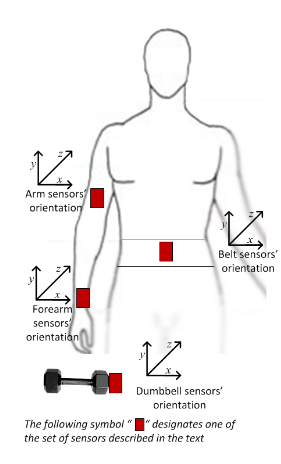

```{r setup, include=FALSE}
knitr::opts_chunk$set(echo = TRUE, warning = FALSE, message = FALSE, cache = TRUE)
```

## About the data

* In this project, we analyze the Human Activity Recognition (HAR) Weight Lifting Exercises Dataset and build a classification algorithm to predict the type of activities(`classe` variable) based on sensor data.Six young health participants were asked to perform one set of 10 repetitions of the Unilateral Dumbbell Biceps Curl in five different fashions:
    - exactly according to the specification (**Class A**)
    - throwing the elbows to the front (**Class B**)
    - lifting the dumbbell only halfway (**Class C**)
    - lowering the dumbbell only halfway (**Class D**)
    - throwing the hips to the front (**Class E**)

* The sensors used are accelerometers, gyroscopes and magnetometers placed on arm, forearm, belt and dumbbell.These sensors captures orientation angle (roll - pitch - yaw), acceleration, angular velocity and magnetic field data strengths along x,y and z axes and the statistical features (kurtosis, skewness, max, min, amplitude, variance, standard deviation) of these data are recorded in dataset.

You can find more information about the study [here]("https://web.archive.org/web/20161224072740/http:/groupware.les.inf.puc-rio.br/har").

```{r, echo=FALSE, fig.cap='body sensors'}

```

## Load the data

```{r}
training <- read.csv("https://d396qusza40orc.cloudfront.net/predmachlearn/pml-training.csv", na.strings = c("", NA))
testing <- read.csv("https://d396qusza40orc.cloudfront.net/predmachlearn/pml-testing.csv", na.strings = c("", NA))
```

## Load necessary libraries

```{r}
library(DataExplorer)
library(dplyr)
library(randomForest)
library(caret)
library(ggplot2)
library(gridExtra)
library(reshape2)
library(rpart)
library(rpart.plot)
library(skimr)
library(corrplot)
library(caretEnsemble)
library(pryr)
library(gbm3)
library(glmnet)
```

## Initial looks

```{r}
introduce(training)
dim(testing)
colnames(training)
```

* The training data contains 19622 observations of 160 variables and the testing data contains 20 observations of 160 variables.

* First we omit the metadata including user names, time data and window chunks since we will try to classify rows only based on sensor data. In fact, including the meta data like user names or time introduces significant overfitting. Especially user names are highly decisive on sensor readings. You can see about this details on appendix.

```{r}
#omit metadata
training2 <- training %>% select(-c(X,user_name,raw_timestamp_part_1,raw_timestamp_part_2,cvtd_timestamp,new_window,num_window))
testing2 <- testing %>% select(-c(X,user_name,raw_timestamp_part_1,raw_timestamp_part_2,cvtd_timestamp,new_window,num_window))

#convert outcome into factor
training2$classe <- as.factor(training2$classe)

# Handle missing values: remove columns with more than 70% missing data
na_props <- training2 %>% summarise(across(everything(), ~ sum(is.na(.)) / length(.)))
high_na_cols <- na_props %>% select(where(~ . > 0.7))
training3 <- training2[, !(colnames(training2) %in% colnames(high_na_cols))]
testing3 <- testing2[, !(colnames(testing2) %in% colnames(high_na_cols))]
```

## Splitting the training data into training and validation sets

```{r}
set.seed(123)
inTrain <- createDataPartition(y = training3$classe, p = 0.7, list = FALSE)
training4 <- training3[inTrain, ]
validation <- training3[-inTrain, ]
testing4 <- testing3
```

## Insights on cleaned training data

```{r}
# a second look using skim function
skim(training4)

#check correlations
numeric_features <- training4 %>% select_if(is.numeric)
cor_matrix <- cor(numeric_features)
corrplot(cor_matrix, 
         tl.cex = .7,     # Reduce text label size
         tl.srt = 70,      # Rotate the labels by 45 degrees
         method = "circle" # Use circles for a clean look
)

#check class imbalance
table(training4$classe)
```

* There are skewed variables in our data, although not many.
* The scales of some sensor measurement data are different where some of them high standard deviations.
* There is some collinearity in our data, especially between measurements from same device or same body parts.
* There is no class imbalance in outcome.
* Based on this insights, we will center and scale our data and reduce it to principal components.

## Preprocess the data
```{r}
#center and scale training4
preProc_train <- preProcess(training4, method = c("center", "scale"))

#transform the data
training5 <- predict(preProc_train, newdata = training4)
validation2 <- predict(preProc_train, newdata = validation)
testing5 <- predict(preProc_train, newdata = testing4)

#apply pca
pca <- prcomp(training5[, -which(names(training5) %in% c("classe"))])
pca_var <- pca$sdev^2 / sum(pca$sdev^2)
cum_var <- cumsum(pca_var)

#cumulative explained variance vs. number of principal components
plot(cum_var, xlab = "Number of Principal Components", 
     ylab = "Cumulative Proportion of Variance Explained", 
     type = "b", col = "blue", pch = 19,
     main = "Cumulative Variance Explained by Principal Components")
abline(h = 0.9, col = "red", lty = 2)
pca_transformed_data <- pca$x[, 1:18]

#transform the data using principal components by 90% cutoff on explained variance
training6 <- data.frame(pca_transformed_data, classe = training5$classe)
validation3 <- data.frame(predict(pca, newdata = validation2)[, 1:18],classe = validation2$classe)
testing6 <- predict(pca, newdata = testing5)[, 1:18]
```

## Model Selection

* We will define a trainControl function `control_base` because we will plan to stack models in the end. 

* First we train a multinomial logistic regression model. 

### Multinomial Logistic Regression
```{r results='hide'}
control_base <- trainControl(method = "cv", number = 5, savePredictions = "final", classProbs = TRUE)
Rprof("memory_profile.out", memory.profiling = TRUE)
model_glm <- train(classe ~ ., 
                   data = training6, 
                   method = "multinom", 
                   trControl = control_base,
                   verbose = FALSE)
Rprof(NULL)
```

```{r}
time_glm1 <- summaryRprof("memory_profile.out", memory = "both")$by.total
memory_glm1 <- summaryRprof("memory_profile.out", memory = "both")$memory
tm_glm <- sapply(list(time_glm1$total.time,time_glm1$mem.total),max)
model_glm_preds <- predict(model_glm,validation3)
conf_matrix <- confusionMatrix(model_glm_preds, validation3$classe)
model_glm$results
conf_matrix$overall["Accuracy"]
```

#### Tuning `model_glm`

```{r results="hide"}
tune_grid <- expand.grid(decay = seq(0, 0.1, by = 0.01))

Rprof("memory_profile.out", memory.profiling = TRUE)
model_glm_tuned <- train(
    classe ~ ., 
    data = training6, 
    method = "multinom", 
    trControl = control_base, 
    tuneGrid = tune_grid, 
    maxit = 200,
    verbose = FALSE
)
Rprof(NULL)
time_glm_tuned <- summaryRprof("memory_profile.out", memory = "both")$by.total
```

```{r}
tm_glm_tuned <- sapply(list(time_glm_tuned$total.time,time_glm_tuned$mem.total),max)
head(model_glm_tuned$results)
model_glm_tuned_preds <- predict(model_glm_tuned,validation3)
conf_matrix <- confusionMatrix(model_glm_tuned_preds, validation3$classe)
conf_matrix$overall["Accuracy"]
```

### KNN

* We train k-nearest-neighbors model using `control_base` again and 10 different numbers of $k$.

```{r}
Rprof("memory_profile.out", memory.profiling = TRUE)
model_knn <- train(classe ~ ., data = training6, method = "knn", trControl = control_base, tuneLength = 10)
Rprof(NULL)
time_knn <- summaryRprof("memory_profile.out", memory = "both")$by.total
tm_knn <- sapply(list(time_knn$total.time,time_knn$mem.total),max)
head(model_knn$results)
model_knn_preds <- predict(model_knn,validation3)
conf_matrix <- confusionMatrix(model_knn_preds, validation3$classe)
conf_matrix$overall["Accuracy"]
```

* Knn performed better than glm but we will try decision trees for a much better accuracy.

### Decision Tree

```{r}
tree_tune_grid <- expand.grid(cp = seq(0.001, 0.05, by = 0.001))
Rprof("memory_profile.out", memory.profiling = TRUE)
model_tree <- train(classe ~ ., data = training6, 
                    method = "rpart", 
                    trControl = control_base, 
                    tuneGrid = tree_tune_grid)
Rprof(NULL)
time_tree <- summaryRprof("memory_profile.out", memory = "both")$by.total
tm_tree <- sapply(list(time_tree$total.time,time_tree$mem.total),max)
model_tree_preds <- predict(model_tree,validation3)
conf_matrix <- confusionMatrix(model_tree_preds, validation3$classe)
conf_matrix$overall["Accuracy"]
```

### Random Forest

```{r}
Rprof("memory_profile.out", memory.profiling = TRUE)
model_rf <- train(classe ~ ., data = training6, method = "rf",trControl = control_base, importance = TRUE)
Rprof(NULL)
time_rf <- summaryRprof("memory_profile.out", memory = "both")$by.total
tm_rf <- sapply(list(time_rf$total.time,time_rf$mem.total),max)
model_rf_preds <- predict(model_rf$finalModel,validation3)
conf_matrix <- confusionMatrix(model_rf_preds, validation3$classe)
conf_matrix$overall["Accuracy"]
```

* Random Forest performs well on training data. We will try Boosting to see if it can increase accuracy.

### Boosting

```{r results='hide'}
Rprof("memory_profile.out", memory.profiling = TRUE)
model_boost <- train(
  classe ~ ., 
  method = "gbm", 
  data = training6, 
  trControl = control_base,
  verbose = FALSE,  # Prevents printing during training
  tuneLength = 10   # This will try 10 different hyperparameter combinations
)
Rprof(NULL)
```

```{r}
time_boost <- summaryRprof("memory_profile.out", memory = "both")$by.total
tm_boost <- sapply(list(time_boost$total.time,time_boost$mem.total),max)
model_boost_preds <- predict(model_boost,validation3)
conf_matrix <- confusionMatrix(model_boost_preds, validation3$classe)
conf_matrix$overall["Accuracy"]
```

* Finally, we stack all models with glmnet as a base learner.

### Model Stacking

```{r results='hide'}
# Model Stacking with Profiling
base_learners <- list(
    rpart = model_tree,    # Using the caret model directly
    rf = model_rf,         # Full caret model
    knn = model_knn,       # Full caret model
    glm = model_glm_tuned, # Logistic regression tuned model
    gbm = model_boost      # Boosted model
)

# Control for stacking models
stack_control <- trainControl(method = "cv", number = 5, savePredictions = "final", classProbs = TRUE)

# Profiling the stacking process
Rprof("memory_profile_stack.out", memory.profiling = TRUE)

# Stacking the models
model_stack <- caretStack(
    base_learners,
    method = "glmnet",    # Use glmnet for model stacking
    metric = "Accuracy",  # Metric to optimize
    trControl = stack_control
)

Rprof(NULL)

```

```{r}
# Profiling results
time_stack <- summaryRprof("memory_profile_stack.out", memory = "both")$by.total
tm_stack <- sapply(list(time_stack$total.time, time_stack$mem.total), max)

summary(model_stack)

model_stack_preds <- predict(model_stack, newdata = validation3)
model_stack_preds <- apply(model_stack_preds, 1, function(x) colnames(model_stack_preds)[which.max(x)])
model_stack_preds <- as.factor(model_stack_preds)
validation_actual <- as.factor(validation3$classe)
conf_matrix <- confusionMatrix(model_stack_preds, validation_actual)
conf_matrix$overall["Accuracy"]
```

### Comparing the Models

```{r}
models <- list(
    glm = model_glm,
    glm_tuned = model_glm_tuned,
    knn = model_knn,
    tree = model_tree,
    rf = model_rf,
    boost = model_boost,
    stack = model_stack
)

# Initialize a list to store predictions
predictions <- list()

# Generate predictions for each model
for (model_name in names(models)) {
    if (model_name == "stack") {
        # For the stacked model, predictions may be probabilities
        pred_probs <- predict(models[[model_name]], newdata = validation3)
        # Convert probabilities to class labels
        preds <- apply(pred_probs, 1, function(x) colnames(pred_probs)[which.max(x)])
        predictions[[model_name]] <- as.factor(preds)
    } else {
        # For other models, directly predict class labels
        predictions[[model_name]] <- predict(models[[model_name]], newdata = validation3)
    }
}


# Initialize a data frame to store performance metrics
performance_metrics <- data.frame(
    Model = character(),
    Class = character(),
    Sensitivity = numeric(),
    Specificity = numeric(),
    Pos_Pred_Value = numeric(),
    Neg_Pred_Value = numeric(),
    Prevalence = numeric(),
    Detection_Rate = numeric(),
    Detection_Prevalence = numeric(),
    Balanced_Accuracy = numeric(),
    stringsAsFactors = FALSE
)

# Loop over each model to extract per-class metrics
for (model_name in names(predictions)) {
    cm <- confusionMatrix(predictions[[model_name]], validation3$classe)
    
    # Extract the per-class metrics
    byClass <- as.data.frame(cm$byClass)
    
    # Since in multiclass, the row names might be like "Class: A", extract the class labels
    byClass$Class <- rownames(byClass)
    byClass$Class <- sub("Class: ", "", byClass$Class)
    
    # Add the model name
    byClass$Model <- model_name
    
    # Reorder columns
    byClass <- byClass[, c("Model", "Class", names(byClass)[1:(ncol(byClass)-2)])]
    
    # Append to the performance_metrics data frame
    performance_metrics <- rbind(performance_metrics, byClass)
}

# Rename columns for clarity
colnames(performance_metrics) <- c(
    "Model", "Class", "Sensitivity", "Specificity",
    "Pos_Pred_Value", "Neg_Pred_Value", "Precision",
    "Recall", "F1", "Prevalence", "Detection_Rate",
    "Detection_Prevalence", "Balanced_Accuracy"
)

performance_metrics <- performance_metrics %>% select(-Recall) %>% arrange(desc(Balanced_Accuracy))

profiling_data <- data.frame(
  Model = c("glm", "glm_tuned", "knn", "tree", "rf", "boost", "stack"),
  Training_Time = c(tm_glm[1], tm_glm_tuned[1], tm_knn[1],
                    tm_tree[1], tm_rf[1], tm_boost[1], tm_stack[1]),
  Memory_Usage = c(tm_glm[2], tm_glm_tuned[2], tm_knn[2],
                    tm_tree[2], tm_rf[2], tm_boost[2], tm_stack[2])
)
profiling_data <- profiling_data %>% arrange(desc(Memory_Usage),desc(Training_Time)) %>% mutate(Training_Time = round(Training_Time/60,3))
rownames(performance_metrics) <- 1:35
head(performance_metrics,10)
```

* As seen in the comparison table, stacking model outperforms other models and we choose it for predictions and evaluation on unseen data.
```{r}
profiling_data
```
* Random Forest and Boosting from stacked models have highes computation time and use largest memory.